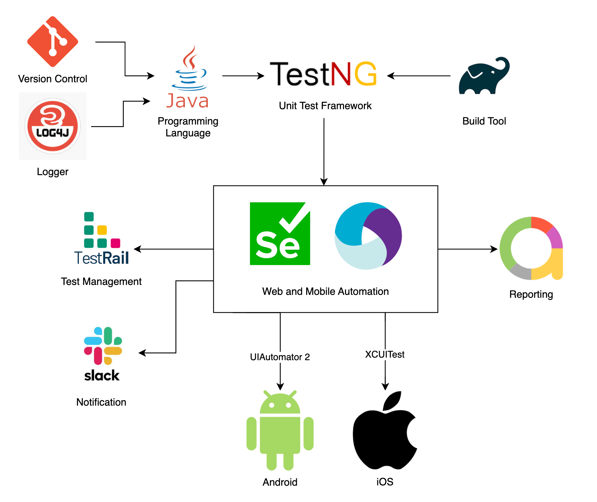

<div align="center">


# Java Mobile Automation Framework

[//]: # (![Badge]&#40;https://img.shields.io/badge/badge-badge-brightgreen&#41;)

[//]: # (![Badge]&#40;https://img.shields.io/badge/badge-badge-brightgreen&#41;)

[//]: # (![Badge]&#40;https://img.shields.io/badge/badge-badge-brightgreen&#41;)

[Overview](#scroll-overview)
•
[Framework Stack](#rice_scene-screenshot)
•
[Documentation](#blue_book-documentation)
•
[Directory Tree](#dvd-demo)
</div>

## :bookmark_tabs: Menu

- [Overview](#scroll-overview)
- [Framework Stack](#rice_scene-screenshot)
- [Documentation](#blue_book-documentation)
    - [Prerequisites](#exclamation-requirements)
    - [Design Patterns](#open_file_folder-folder-structure)
    - [Folder Structure](#open_file_folder-folder-structure)
    - [Dependencies](#heavy_check_mark-dependencies-and-libs)
- [Demo](#dvd-demo)

## :scroll: Overview

An end to end java mobile test framework utilizing the latest tech available in January 2023.

## :factory: Framework Stack



## :blue_book: Documentation

- Enable 'Use default reporters' for TestNG xml on the Listeners tab of Run/Debug configurations

  
## :exclamation: Prerequisites

- Java 16 SDK or lower [(because of this issue)](https://github.com/appium/java-client/issues/1619)
- Appium
- Selenium
- Allure 
- Android Emulator
- iOS Simulator

## :rice_scene: Design Patterns

[Page Object Model:](https://www.selenium.dev/documentation/test_practices/encouraged/page_object_models/) A structure where every page of the 
application is represented with a class that contains the elements for that page with the methods 
for interacting with these elements. When the UI of the app changes the tests themselves don’t need to change,
only the page object class should be updated. The advantages of POM:
- Easier code maintenance
- Code reusability
- Improved readability and reliability

[Page Factory:](https://www.testim.io/blog/page-factory-in-selenium/) Provides @FindBy annotation to locate and declare elements using different locator strategies. 
It uses a lazy load initElements() static method to initialize the elements only when they are used in an operation 
or activity.

## :ear: Listeners

- EventListener: A WebDriverListener for Appium related events
- TestListener: An ITestListener listener for TestNG related events
- AnnotationTransformer: For retrying failed test cases up to 3 times

## :floppy_disk: Dependencies and libs

- [TestNG](https://testng.org/doc/documentation-main.html)
- [Appium2](https://github.com/appium/appium)
- [Selenium4](https://github.com/SeleniumHQ/selenium)
- [Allure](https://docs.qameta.io/allure/)
- [Log4j2](https://logging.apache.org/log4j/2.x/)
- [codepine/testrail-api-java-client](https://github.com/codepine/testrail-api-java-client)
- [Slack API Client]()

## :open_file_folder: Directory Tree

```
MobileAutomationFramework
├── images
│   ├── framework_stack.png
│   ├── IDE.png
│   └── logo.png
├── src
│   ├── main
│   │   ├── java
│   │   │   ├── framework
│   │   │   │   ├── core
│   │   │   │   │   ├── BasePage.java
│   │   │   │   │   └── BaseTest.java
│   │   │   │   └── platform
│   │   │   │       ├── AndroidBaseTest.java
│   │   │   │       └── IOSBaseTest.java
│   │   │   └── utils
│   │   │       ├── listeners
│   │   │       │   ├── AnnotationTransformer.java
│   │   │       │   ├── EventListener.java
│   │   │       │   ├── ExecutionListener.java
│   │   │       │   └── TestListener.java
│   │   │       ├── slack
│   │   │       │   └── SlackUtil.java
│   │   │       ├── testrail
│   │   │       │   ├── TestRailID.java
│   │   │       │   └── TestRailUtil.java
│   │   │       ├── PropertyReader.java
│   │   │       └── RetryAnalyzer.java
│   │   └── resources
│   │       ├── android.properties
│   │       ├── ios.properties
│   │       ├── log4j2.properties
│   │       ├── slack.properties
│   │       └── testrail.properties
│   └── test
│       ├── java
│       │   ├── pages
│       │   │   ├── HomePage.java
│       │   │   ├── SignInPage.java
│       │   │   └── ValidationPage.java
│       │   ├── suites
│       │   │   ├── android.xml
│       │   │   └── ios.xml
│       │   └── tests
│       │       ├── android
│       │       │   ├── HomeTests.java
│       │       │   ├── SignInTests.java
│       │       │   └── ValidationTests.java
│       │       └── ios
│       │           ├── HomeTests.java
│       │           ├── SignInTests.java
│       │           └── ValidationTests.java
│       └── resources
│           └── apps
│               ├── demoApp.apk
│               └── demoApp.zip
├── .gitignore
├── build.gradle
├── gradlew
├── gradlew.bat
├── readme.md
└── settings.gradle
```
## :dvd: Demo

- After the configuration is adjusted in the properties files, a test run can be initiated by running one of the testNG suites.


- Allure report


- Slack notification
  
